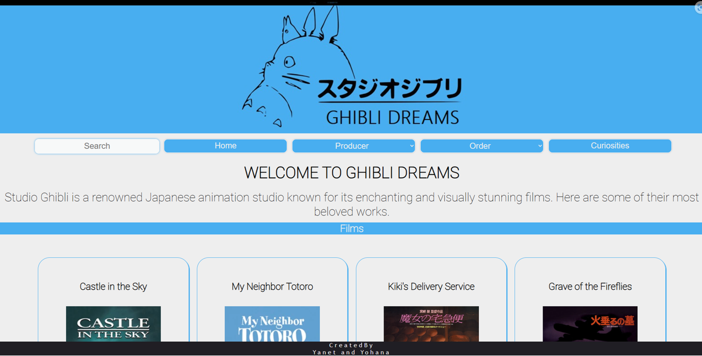
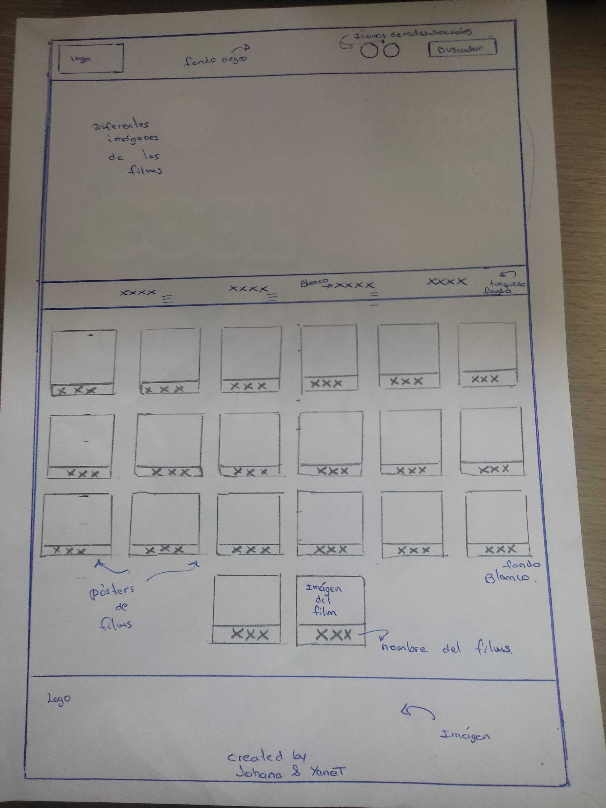
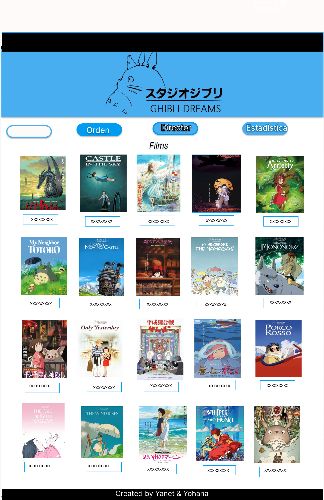
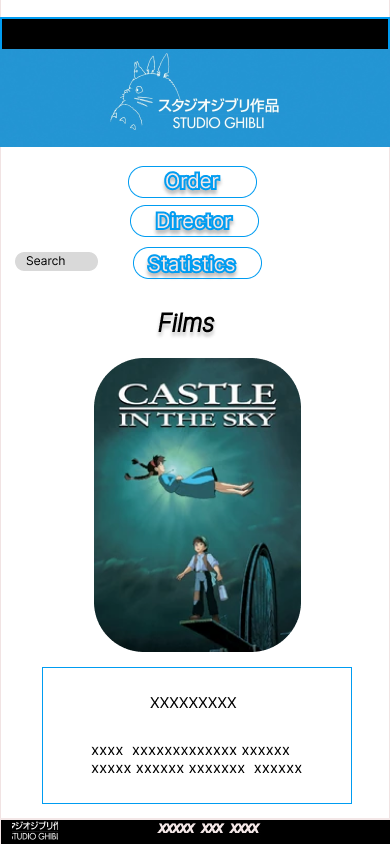

# PROYECT DATA LOVERS
***
## Índice
* [1. Preámbulo](#1-Preámbulo)
* [2. Resumen Proyecto](#2-Resumen-de-proyecto)
* [3. Componentes del proyecto ](#3-Componentes-del-proyecto )
* [4. Investigacion UX](#4-Investigacion-UX)
* [5. Diseño de la Interfaz de Usuario](#5-objetivos-de-aprendizaje)
* [6. Implementación de la Interfaz de Usuario](#6-implementacion-de-la-interfaz-de-usuario)
* [7. Resultado del proyecto](#5-Resultado-del-proyecto)
***

# 1. Preámbulo
🙋💬 Hola somos Yanet y Yohana...Bienvenidos al mundo Ghibli de nuestro proyecto Data Lovers! Antes de empezar, queremos explicar que  Si hay algo que caracteriza el anime de este siglo XXI es la influencia que estudio Ghibli y Hayao Miyazaki han tenido en él. Prácticamente todos los directores de renombre se sienten influidos por sus películas, lo que nos ha dado un anime de calidad indiscutible. Nuestra página te muestra 20 posters de films con detalles acerca del director, productor, descripción entre otros, te hará recordar  los grandes hitos del estudio: ecología, monstruos, humanismo, viajes a mundos inimaginables, ternura e imaginación. Te invitamos a recordar estas piezas de arte y animarte a que las veas por primera vez o verlas nuevamente.

Encontrarás más información en: https://es.wikipedia.org/wiki/Studio_Ghibli , https://www.ghibli.jp/ , https://www.netflix.com/pe/browse/genre/81227213.

# 2. Resumen de Proyecto
El proyecto consiste en la construcción de una página web que se adapte a diversos formatos de pantallas. 
Nuestro objetivo es crear un sitio web llamado "Ghibli Dreams" donde los usuarios puedan encontrar un directorio de 20 películas del Studio Ghibli, incluyendo información detallada como el año de lanzamiento, el director, el productor y otras características relevantes. Queremos proporcionar a los usuarios una fuente confiable y completa de información sobre las películas de Studio Ghibli en un solo lugar.

El proyecto se ha desarrollado utilizando HTML puro, CSS y Javascript basada en data de formato Json. Como versión final nuestra página web permite visualizar la data, filtrarla, ordenarla y ver el cálculo agregado.

# 3. Componentes del proyecto 
**3.1 Objetivo General:**
Realizar una interfaz que me permita visualizar los posters con informacion de los films de Studios Ghibli desde cualquier dispositivo.

**3.2 Objetivos específicos:**
*	Definir las necesidades del usuario para poder determinar los componentes que contendrá la interfaz.
*	Maquetación de la página web.
* Creación de Historias de Usuario.
* Revisión de Objetivos de aprendizaje.

## Presentación

 

***
# 4.Investigacion UX 
Nuestro proceso creativo consta principalmente de 4 etapas fundamentales:
* Historias de usuario
* Prototipado en baja y alta fidelidad
* Testeo de prototipo con usuarios
* Búsqueda de referencias

## Historias de usuario

Para desarrollar "Ghibli Dreams", las historias de usuario son el primer paso para construir la web.
se ha identificado las siguientes necesidades y requerimientos de los usuarios, expresados en forma de historias de usuario:

### Historia N°1: "Yo como usuario, quiero poder ver una página web donde se visualicen las imágenes de los films, los títulos de las películas y el año de estreno producidas por Studios Ghibli."

* Definición de terminado:
  Se ha implementado una función que mostrará los 20 posters. 
  La historia se testeó a 5 usuarios reales y se hicieron los cambios resultantes del testeo.
  La página debe ser responsive. En versión mobile debe mostrar un listado de 20 pokemon.
* Criterios de aceptación:
  Las y los usuarios verán una galería de 20 posters ordenada.
  El usuario podrá hacer uso del scroll para ver los demás posters.

### Historia N°2: "Yo como usuario, quiero poder buscar y explorar las 20 películas de Studio Ghibli disponibles filtrar los films producidas por cada productor.

* Criterios de aceptación:
  Las y los usuarios verán un buscador donde podrán escribir el nombre del film  y encontrar un boton desplegable donde se filtre por productor a buscar.
  El usuario podrá hacer la búsqueda de otro poster usando el buscador.
  En caso del filtrado por productor solo se mostrará lo seleccionado.

* Definición de terminado:
El buscador arrojará las coincidencias.
La galería debe mostrar los posters según la búsqueda.
Hacer el test para comprobar si llama a todos los posters.
La historia se testeó en usuarios reales y se hicieron los cambios resultantes del testeo.

### Historia N°3: "Yo como usuario, quiero revisar el listado de películas por orden alfabético"

* Definición de terminado: 
  Al dar clic al botón "order" debe mostrar las opciones de orden de la A-Z y Z-A.  
  Los posters del film que se muestren debe ordenarse según A-Z o Z-A.
  Hacer el test para comprobar si ordena correctamente.
  Se testeó en usuarios reales y se hicieron los cambios resultantes del testeo. 

* Criterios de aceptación: 
  Los y las usuarias verán un menú desplegable para ordenar los posters alfabéticamente.
  Al dar clic, el menú desplegable muestra las opciones A-Z y Z-A. Podrán escoger entre las 2 opciones.
  Según la opción escogida, la galería se actualizarán para encontrar al poster del film deseado.

### Historia N°4: "Yo como usuario, quiero conocer el porcentaje de los personajes por especie, género y rating de los 20 films de Studio Ghibli."

* Definición de terminado: Se incluyen tanto el porcentaje por especie dividido en: humano vs no huamano, por género: femenino vs masculino por rating de las peliculas: debajo del 89% y por encima o igual a 89% hechas por el estudio Ghibli.

* Criterios de aceptación: Que los porcentajes se muestren de acuerdo al porcentaje.

## 5. Diseño de la Interfaz de Usuario

Fotos del prototipo de baja fidelidad📱: 

### Prototipo idea en papel y lápiz 
 
### Prototipo de baja fidelidad 

### Prototipo de alta fidelidad
Nos dividimos los prototipos de alta fidelidad: una trabajó la versión de escritorio y la otra trabajó la versión mobile.
  Después del Test de Usuario como dupla decidimos modificar algunos elementos a partir del feedback recibido.
  Finalmente nos basamos en el prototipo ya modificado para dar paso a la estructura del HTML y CSS.

  

Link a Figma

  * https://www.figma.com/file/Zv5CarpyCWkcvg3Ese635O/DATA-LOVERS?type=design&node-id=0-1&t=Urm0epjSQSbc95li-0

#### Prototipo en alta fidelidad versión escritorio

 ***
#### Prototipo en alta fidelidad versión para móvil 
 
   

Link a Figma

  * https://www.figma.com/file/ITTasGXv8iISzWN2ButKI7/Untitled?type=design&t=1GSZ4C5AjO0yaoPC-0

 ****
### Testeo en usuarios

Se realizó testeo con usuarios entre 15 a 40 años, quienes indican que los colores siguen la identidad gráfica del estudio Ghibli, que es agradable e intuitiva. Como sugerencia nos indicaron cambiaramos la imagen que iba en la portada. 
***

## 6. Implementación de la Interfaz de Usuario (HTML/CSS/JS)

La implementación consta en:

* HTML: Muestra la data en una interfaz mediante listas.
Permite a la usuaria interactuar para obtener la infomación que necesita.

* CSS: Se agregaron estilos a cada sección correspondiente. La interfaz sigue los fundamentos del Visual Design.

Es responsive, se visualiza sin problemas desde distintos tamaños de pantallas: móviles, tablets y desktops. Se trabajó con media Queries y grillas.

* JavaScript: se encuentra una hoja con nombre data.js la cual contiene toda la lógica y las funciones de la web, la cual se exporta a otra hoja con nombre de main.js, que contiene toda la conexión con el DOM y sus eventos para que el usuario pueda interactuar con ella.

### HTML

- [✔] **Uso de HTML semántico**

  

Links

  * [HTML semántico](https://curriculum.laboratoria.la/es/topics/html/02-html5/02-semantic-html)
  * [Semantics - MDN Web Docs Glossary](https://developer.mozilla.org/en-US/docs/Glossary/Semantics#Semantics_in_HTML)

### CSS

- [✔] **Uso de selectores de CSS**

  

Links

  * [Intro a CSS](https://curriculum.laboratoria.la/es/topics/css/01-css/01-intro-css)
  * [CSS Selectors - MDN](https://developer.mozilla.org/es/docs/Web/CSS/CSS_Selectors)

- [✔] **Modelo de caja (box model): borde, margen, padding**

  

Links

  * [Box Model & Display](https://curriculum.laboratoria.la/es/topics/css/01-css/02-boxmodel-and-display)
  * [The box model - MDN](https://developer.mozilla.org/en-US/docs/Learn/CSS/Building_blocks/The_box_model)
  * [Introduction to the CSS box model - MDN](https://developer.mozilla.org/en-US/docs/Web/CSS/CSS_Box_Model/Introduction_to_the_CSS_box_model)
  * [CSS display - MDN](https://developer.mozilla.org/pt-BR/docs/Web/CSS/display)
  * [display - CSS Tricks](https://css-tricks.com/almanac/properties/d/display/)

- [✔] **Uso de flexbox en CSS**

  

Links

  * [A Complete Guide to Flexbox - CSS Tricks](https://css-tricks.com/snippets/css/a-guide-to-flexbox/)
  * [Flexbox Froggy](https://flexboxfroggy.com/#es)
  * [Flexbox - MDN](https://developer.mozilla.org/en-US/docs/Learn/CSS/CSS_layout/Flexbox)

### Web APIs

- [✔] **Uso de selectores del DOM**

  

Links

  * [Manipulación del DOM](https://curriculum.laboratoria.la/es/topics/browser/02-dom/03-1-dom-methods-selection)
  * [Introducción al DOM - MDN](https://developer.mozilla.org/es/docs/Web/API/Document_Object_Model/Introduction)
  * [Localizando elementos DOM usando selectores - MDN](https://developer.mozilla.org/es/docs/Web/API/Document_object_model/Locating_DOM_elements_using_selectors)

- [✔] **Manejo de eventos del DOM (listeners, propagación, delegación)**

  

Links

  * [Introducción a eventos - MDN](https://developer.mozilla.org/es/docs/Learn/JavaScript/Building_blocks/Events)
  * [EventTarget.addEventListener() - MDN](https://developer.mozilla.org/es/docs/Web/API/EventTarget/addEventListener)
  * [EventTarget.removeEventListener() - MDN](https://developer.mozilla.org/es/docs/Web/API/EventTarget/removeEventListener)
  * [El objeto Event](https://developer.mozilla.org/es/docs/Web/API/Event)

- [✔] **Manipulación dinámica del DOM**

  

Links

  * [Introducción al DOM](https://developer.mozilla.org/es/docs/Web/API/Document_Object_Model/Introduction)
  * [Node.appendChild() - MDN](https://developer.mozilla.org/es/docs/Web/API/Node/appendChild)
  * [Document.createElement() - MDN](https://developer.mozilla.org/es/docs/Web/API/Document/createElement)
  * [Document.createTextNode()](https://developer.mozilla.org/es/docs/Web/API/Document/createTextNode)
  * [Element.innerHTML - MDN](https://developer.mozilla.org/es/docs/Web/API/Element/innerHTML)
  * [Node.textContent - MDN](https://developer.mozilla.org/es/docs/Web/API/Node/textContent)

### JavaScript

- [✔] **Diferenciar entre tipos de datos primitivos y no primitivos**

- [✔] **Arrays (arreglos)**

  

Links

  * [Arreglos](https://curriculum.laboratoria.la/es/topics/javascript/04-arrays)
  * [Array - MDN](https://developer.mozilla.org/es/docs/Web/JavaScript/Reference/Global_Objects/Array/)
  * [Array.prototype.sort() - MDN](https://developer.mozilla.org/es/docs/Web/JavaScript/Reference/Global_Objects/Array/sort)
  * [Array.prototype.forEach() - MDN](https://developer.mozilla.org/es/docs/Web/JavaScript/Reference/Global_Objects/Array/forEach)
  * [Array.prototype.map() - MDN](https://developer.mozilla.org/es/docs/Web/JavaScript/Reference/Global_Objects/Array/map)
  * [Array.prototype.filter() - MDN](https://developer.mozilla.org/es/docs/Web/JavaScript/Reference/Global_Objects/Array/filter)
  * [Array.prototype.reduce() - MDN](https://developer.mozilla.org/es/docs/Web/JavaScript/Reference/Global_Objects/Array/Reduce)

- [✔] **Objetos (key, value)**

  

Links

  * [Objetos en JavaScript](https://curriculum.laboratoria.la/es/topics/javascript/05-objects/01-objects)

- [✔] **Variables (declaración, asignación, ámbito)**

  

Links

  * [Valores, tipos de datos y operadores](https://curriculum.laboratoria.la/es/topics/javascript/01-basics/01-values-variables-and-types)
  * [Variables](https://curriculum.laboratoria.la/es/topics/javascript/01-basics/02-variables)

- [✔] **Uso de condicionales (if-else, switch, operador ternario, lógica booleana)**

  

Links

  * [Estructuras condicionales y repetitivas](https://curriculum.laboratoria.la/es/topics/javascript/02-flow-control/01-conditionals-and-loops)
  * [Tomando decisiones en tu código — condicionales - MDN](https://developer.mozilla.org/es/docs/Learn/JavaScript/Building_blocks/conditionals)

- [✔] **Uso de bucles/ciclos (while, for, for..of)**

  

Links

  * [Bucles (Loops)](https://curriculum.laboratoria.la/es/topics/javascript/02-flow-control/02-loops)
  * [Bucles e iteración - MDN](https://developer.mozilla.org/es/docs/Web/JavaScript/Guide/Loops_and_iteration)

- [✔] **Funciones (params, args, return)**

  

Links

  * [Funciones (control de flujo)](https://curriculum.laboratoria.la/es/topics/javascript/02-flow-control/03-functions)
  * [Funciones clásicas](https://curriculum.laboratoria.la/es/topics/javascript/03-functions/01-classic)
  * [Arrow Functions](https://curriculum.laboratoria.la/es/topics/javascript/03-functions/02-arrow)
  * [Funciones — bloques de código reutilizables - MDN](https://developer.mozilla.org/es/docs/Learn/JavaScript/Building_blocks/Functions)

- [✔] **Pruebas unitarias (unit tests)**

  

Links

  * [Empezando con Jest - Documentación oficial](https://jestjs.io/docs/es-ES/getting-started)

- [✔] **Módulos de ECMAScript (ES Modules)**

  

Links

  * [import - MDN](https://developer.mozilla.org/es/docs/Web/JavaScript/Reference/Statements/import)
  * [export - MDN](https://developer.mozilla.org/es/docs/Web/JavaScript/Reference/Statements/export)

- [✔] **Uso de linter (ESLINT)**

- [✔] **Uso de identificadores descriptivos (Nomenclatura y Semántica)**

- [✔] **Diferenciar entre expresiones (expressions) y sentencias (statements)**

### Control de Versiones (Git y GitHub)

- [✔] **Git: Instalación y configuración**

- [✔] **Git: Control de versiones con git (init, clone, add, commit, status, push, pull, remote)**

- [✔] **Git: Integración de cambios entre ramas (branch, checkout, fetch, merge, reset, rebase, tag)**

- [✔] **GitHub: Creación de cuenta y repos, configuración de llaves SSH**

- [✔] **GitHub: Despliegue con GitHub Pages**

  

Links

  * [Sitio oficial de GitHub Pages](https://pages.github.com/)

- [✔] **GitHub: Colaboración en Github (branches | forks | pull requests | code review | tags)**

### Centrado en el usuario

- [✔] **Diseñar y desarrollar un producto o servicio poniendo a las usuarias en el centro**

### Diseño de producto

- [✔] **Crear prototipos de alta fidelidad que incluyan interacciones**

- [✔] **Seguir los principios básicos de diseño visual**

## 7.	Resultado del proyecto

**7.1 Interacción del usuario con la página:**

El objetivo principal del usuario es la de poder visualizar las 20 películas producidas por Studios Ghibli por lo que contendrá las diguientes funciones; 

*	 Visualización de las portadas de las películas con sus respectivos nombres.
*	 Filtro de películas por productores
*	 Ordenado de películas de forma ascendente y descendente. 
*  Datos estadísticos en formato de Datos curiosos acerca de las películas.

Secuencia de uso de la interfaz; 

 - Al ingresar a la página web, se deberá visualizar todas las portadas de las películas con sus respectivos nombres. 
 - Si el usuario desea solamente conocer las películas producidas por un determinado productor, podrá filtrarlas haciendo click en el botón de "Producers" la cual mostrará una lista desplegable donde se visualizará todos los productores a elegir o ingresar el nombre del film en el buscador. 
 - Si el usuario desea poder ordenar de forma ascendente o descente las películas, podrá hacerlo haciendo click en el botón de "Order".
 - Si el usuario desea conocer algunas curiosidades acerca de la película, podrá hacerlo haciendo click en "Curiositis".

**7.2 Interacción visual del usuario con la página:**
La página web deberá ser amigable a la percepción visual del usuario, por lo que se optó en;

* Usar una paleta de colores neutros para no causar conflicto con los poster coloridos de las películas.
* Se hizo responsive para múltiples dispositivos.

** Link de página:**
